# Basics of computer network

## What is a Computer Network? 🧩

- **Definition**: A **Computer Network** is a group of computers/devices connected to share resources and communicate.
    - **Hinglish**: "Simple bolun toh, computer network matlab computers ek doosre se connected hain. Bas itna hi!"
    - **Analogy**: Like a Bollywood movie (3 Idiots) where characters talk about machines with big definitions, but we keep it simple – computers connected together.
- **Example**: Your laptop and sister’s computer connected via Wi-Fi to share files or access the same printer.
- **My Input**: A network can be as small as two devices (peer-to-peer) or as large as the global Internet.

### Why is it Needed? 🤔

- **Resource Sharing**: One printer or storage device shared across multiple computers.
- **Communication**: Enables email, video calls, messaging apps.
- **Data Access**: Fetch data from servers (e.g., Netflix, Google Drive).
- **Scalability**: Connect more devices as businesses grow.
- **Hinglish**: "Yaar, socho office mein ek hi printer hai, sab usse print kar sakte hain network ke wajah se. Yahi power hai network ka!"
- **My Input**: Networks also enable **fault tolerance** (if one path fails, data takes another route) and **security** (firewalls protect networks).

### Where Does it Fit in the Network Model? 🌐

- A Computer Network is the entire system, encompassing all layers of communication models (OSI or TCP/IP).
- This topic is foundational, setting the stage for understanding layered architectures.

### OSI/TCP-IP Layer It Belongs To 🏛️

- Not tied to a single layer; it involves all layers (Physical to Application).
- **My Input**: Later topics will map specific concepts (e.g., cables to Physical Layer, TCP to Transport Layer).

### Real-World Examples 🌍

- **Home Wi-Fi**: Phone, laptop, smart TV connected to a router.
- **Office LAN**: Company computers sharing a database.
- **Internet**: Global network connecting billions of devices.
- **Hinglish**: "Ghar mein Wi-Fi se sab devices connected hote hain – phone, TV, laptop. Yeh chhota sa network hai!"

### Diagram: Basic Network 🖼️

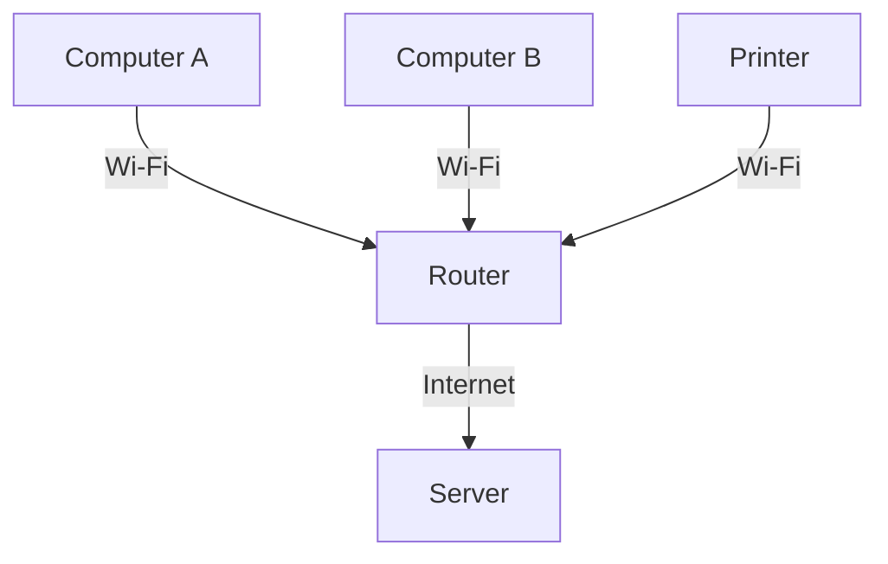

- **Explanation**: Computers A and B connect to a router, which links to the Internet or shared resources like a printer.

## What is the Internet? 🌐

- **Definition**: The **Internet** is a global collection of computer networks connected together.
    - **Hinglish**: "Internet matlab yeh saare computer networks ka bada sa collection hai – ghar, city, country, sab connected!"
    - **Analogy**: Like a giant web where your computer connects to your sister’s, which connects to others’ computers across cities and countries.
- **Key Point**: Internet spans houses, cities, countries via interconnected networks.
- **Example**: Your Wi-Fi connects to your ISP, which connects to global servers (e.g., YouTube, Google).
- **My Input**: The Internet is decentralized – no single entity controls it, unlike a LAN controlled by an admin.

### Diagram: Internet as a Collection of Networks 🖼️

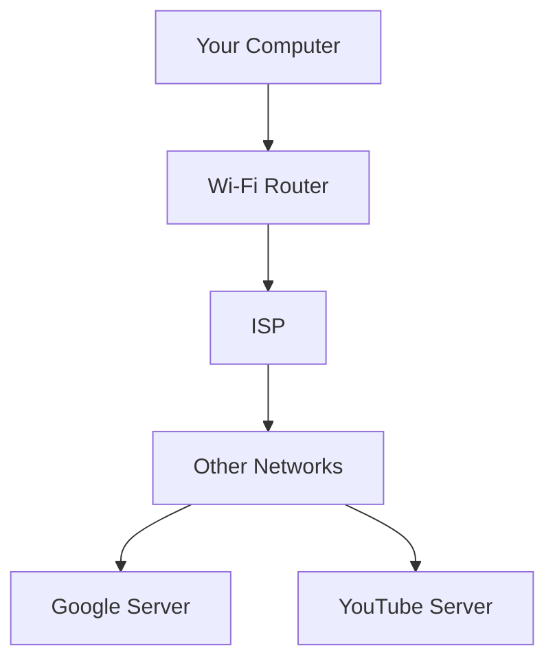

- **Explanation**: Your computer connects to global servers via your ISP and other networks.

## History of the Internet 📜

### How Did the Internet Start? 🕰️

- **Context**: During the **Cold War** (1950s), the US and Soviet Union competed in technology.
    - Soviet Union launched **Sputnik** (1957), the first satellite, beating the US.
    - US response: "Yeh nahi chalega! We need to be first in tech."
- **ARPA Creation**:
    - US formed **ARPA** (Advanced Research Projects Agency) to lead scientific discoveries.
    - **Hinglish**: "US ne socha, humko number one rehna hai. ARPA banaya gaya research ke liye!"
- **ARPANET (1969)**:
    - ARPA connected computers at four locations: **MIT**, **Stanford**, **UCLA**, **University of Utah**.
    - Purpose: Enable communication and file sharing between distant facilities.
    - Used **TCP** (Transmission Control Protocol) for reliable data transfer.
    - **Hinglish**: "Pehli baar chaar universities ke computers connect kiye – yeh tha ARPANET, Internet ka janm!"

### Evolution of the Internet 📈

- **Early Days**: ARPANET was research-focused, not consumer-oriented.
    - More computers and locations were added over time.
    - Protocols like **TCP/IP** became standard (still used today).
- **World Wide Web (WWW)**:
    - **Tim Berners-Lee** invented the WWW (1989) to share linked documents.
    - **Hinglish**: "Research papers share karne ke liye Tim ne WWW banaya – ek document mein doosre ka link!"
    - WWW stores documents on **web servers**, accessible via **URLs** (e.g., `http://info.cern.ch` – the first website).
    - **Analogy**: Like a library where books (web pages) have links to other books.
- **Search Engines**:
    - Early WWW had no search capability; users navigated via hyperlinks.
    - **Yahoo** (early 1990s) was among the first search engines.
    - **Hinglish**: "Pehle search nahi tha, bas links pe click karo. Phir Yahoo aaya, aur aaj Google hai!"
- **Modern Internet**:
    - Includes search engines, Web 3.0, IoT, and more.
    - **My Input**: Today’s Internet supports real-time apps (Zoom, gaming) and cloud computing (AWS, Azure).

### Diagram: ARPANET to WWW 🖼️

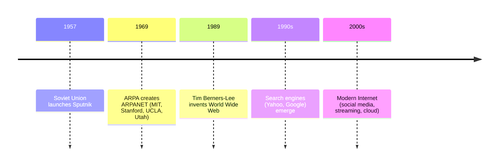

## Introduction to Protocols 📜

- **What are Protocols?**
    - **Definition**: Rules defined by the **Internet Society** for data transfer across networks.
    - **Hinglish**: "Protocols matlab rules jo decide karte hain data kaise jayega. Jaise email bhejna hai, ya video call karna hai – alag-alag rules!"
    - **Analogy**: Like traffic rules – everyone follows the same rules to avoid chaos.
- **Why Protocols are Needed?**
    - Ensure standardized communication between applications worldwide.
    - Without protocols, apps in different countries couldn’t communicate.
    - **Hinglish**: "Socho, agar har country ke apps ke alag rules hote, toh kaise baat hoti? Isliye protocols chahiye!"
- **Who Creates Protocols?**
    - **Internet Society** defines rules via **RFCs** (Request for Comments).
    - Anyone can submit RFCs, but they’re typically from experts.
    - **My Input**: RFCs are public documents (e.g., RFC 791 for IP) – great for learning protocol details.

### Key Protocols Introduced 🛠️

1. **TCP (Transmission Control Protocol)**:
    - Ensures 100% data delivery without corruption.
    - Used for reliable transfers (e.g., emails, secure files).
    - **Hinglish**: "TCP bolta hai, bhai, poora data pahunchega, ek bit bhi miss nahi hoga!"
2. **UDP (User Datagram Protocol)**:
    - Faster but less reliable; some data loss is okay.
    - Used for video conferencing, gaming.
    - **Hinglish**: "UDP mein thodi speed chahiye, thoda data drop ho jaye toh chalega!"
3. **HTTP (HyperText Transfer Protocol)**:
    - Defines how web browsers and servers communicate.
    - Used for WWW (web pages).
    - **Hinglish**: "HTTP bolta hai, browser aur server ke beech kaise data jayega – web pages ke liye!"
- **My Input**: HTTPS (secure HTTP) is now standard, using encryption (TLS/SSL) for secure browsing.

### Protocol Flow Example: Sending an Email 📧

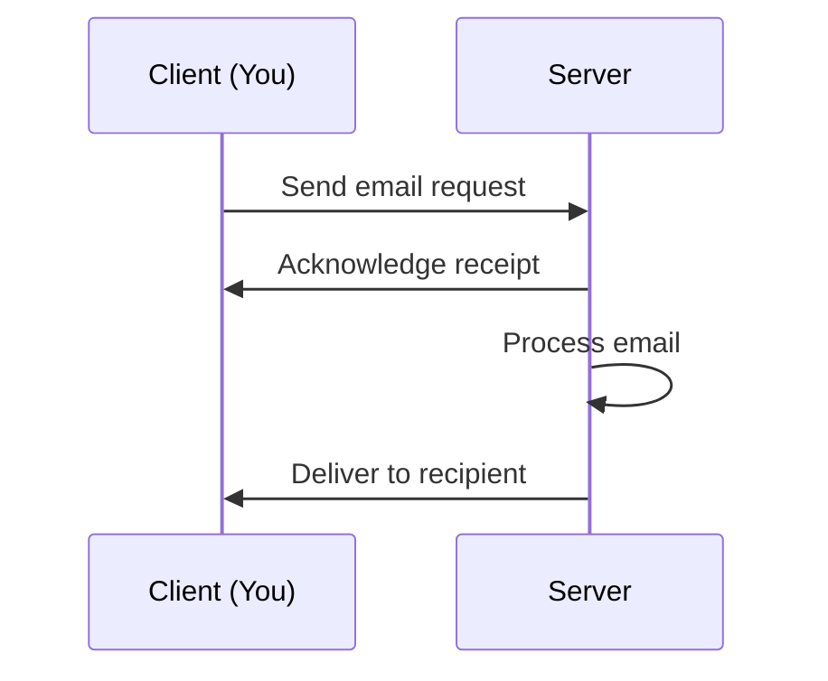

- **Steps**:
    1. You send an email (client to server).
    2. Server acknowledges and processes it.
    3. Email is delivered to the recipient’s server.
- **Hinglish**: "Email bhejte ho, server bolta hai, ‘Thik hai, main bhej doonga.’ Rules follow hote hain!"

## Client-Server Model 🖥️

- **What is a Client?**
    - A device/application requesting a service (e.g., your browser typing `google.com`).
- **What is a Server?**
    - A device/application providing a service (e.g., Google’s server sending a web page).
- **How it Works**:
    - Client sends a **request** (e.g., GET for a web page).
    - Server sends a **response** (e.g., HTML, JavaScript, images).
    - **Hinglish**: "Tum google.com type karte ho, yeh request jati hai Google ke server pe. Wo bolta hai, ‘Le, yeh web page!’"
- **Localhost**: Your computer can act as both client and server (e.g., running a local web server).
- **Example (Inspecting a Web Page)**:
    - Open `google.com`, inspect network tab (F12).
    - See **GET/POST** requests, **status codes** (200 = OK), file types (HTML, JS, PNG).
    - **Hinglish**: "Browser mein inspect karo, dekho kitne requests jate hain – HTML, JS, images, sab aata hai!"

### Diagram: Client-Server Interaction 🖼️

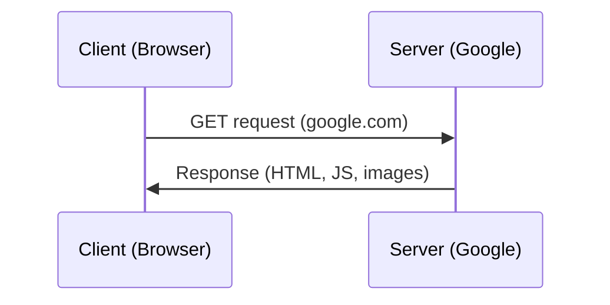

## IP Addresses and Ports 🌐

### What is an IP Address? 📍

- **Definition**: A unique identifier for devices on a network (e.g., `192.168.1.1`).
    - Format: Four numbers (0–255) separated by dots (e.g., `172.217.167.78` for Google).
    - **Hinglish**: "IP address jaise phone number hai – har device ka unique number hota hai!"
- **Analogy**: Like a phone book – you dial “Mom” but the phone uses a number. Similarly, `google.com` resolves to an IP address.
- **Types**:
    - **Global IP**: Assigned by ISP to your router (visible to the Internet).
    - **Local IP**: Assigned by router to devices in your home (e.g., `192.168.x.x`).
- **How to Check**:
    - Use `ifconfig` (Linux/Mac) or `ipconfig` (Windows) to see your device’s IP.
    - **Hinglish**: "Apna IP check karna hai? Terminal mein `ifconfig` type karo, sab dikh jayega!"

### What is a Port? 🚪

- **Definition**: A 16-bit number (0–65,535) identifying an application on a device.
    - **Hinglish**: "Port bolta hai, yeh data kisko bhejna hai – browser ko, game ko, ya MongoDB ko!"
- **Analogy**: IP address = house address; port = specific room (application).
- **Well-Known Ports**:
    - **HTTP**: Port 80
    - **HTTPS**: Port 443
    - **MongoDB**: Port 27017
    - **MySQL**: Port 1433
- **Reserved Ports**: 0–1023 (e.g., HTTP can’t be used for custom apps).
- **Registered Ports**: 1024–49151 (e.g., MongoDB, MySQL).
- **Dynamic Ports**: 49152–65535 (for custom apps).
- **My Input**: Ports prevent data mix-ups. For example, HTTP data goes to your browser, not your game.

### How IP and Ports Work Together? 🛠️

- **Scenario**: You visit `google.com` on your browser.
    - Browser sends a request to Google’s IP (e.g., `172.217.167.78`) on port 80 (HTTP).
    - Google’s server responds to your IP and port (browser’s temporary port).
- **Router Role**:
    - Your router uses **NAT** (Network Address Translation) to map global IP to local IPs.
    - **Hinglish**: "Router bolta hai, yeh request device 1 se aaya, wapas usi ko bhejo!"
- **DHCP (Dynamic Host Configuration Protocol)**:
    - Router assigns local IPs to devices using DHCP.
    - **Hinglish**: "Router DHCP se bolta hai, le tera local IP – 192.168.1.2!"

### Diagram: IP and Port Interaction 🖼️

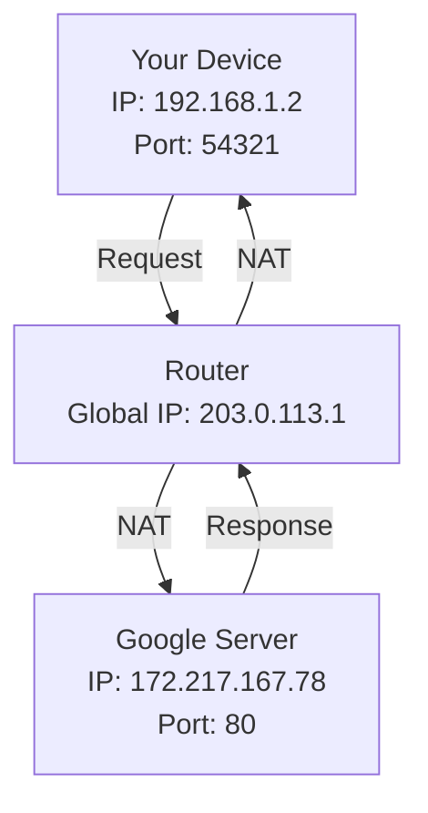

## Data Transfer and Packets 📦

- **How Data is Transferred?**
    - Data is sent in **packets** (small chunks), not as a whole file.
    - **Hinglish**: "Bada file ek baar mein nahi bhejte – chhote-chhote packets mein banta hai, jaise couriers!"
    - **Analogy**: Sending a book page by page instead of the whole book.
- **Why Packets?**
    - Efficient: Smaller chunks are easier to manage.
    - Reliable: Lost packets can be resent.
- **Example**: Loading `google.com` involves multiple packets (HTML, JS, images).
- **My Input**: Packets include headers (metadata like source/destination IP, port) for routing.

## Internet Speed and Measurement 📏

- **What is Internet Speed?**
    - Measured in **Mbps** (Megabits per second) or **Gbps** (Gigabits per second).
    - **Hinglish**: "Speed bolta hai kitne bits ek second mein transfer ho sakte hain – 1 Mbps matlab 10^6 bits!"
- **Key Terms**:
    - **Bit**: 0 or 1 (smallest unit).
    - **Byte**: 8 bits.
    - **1 Mbps**: 1,000,000 bits/second (not bytes).
    - **1 Gbps**: 1,000,000,000 bits/second.
    - **1 Kbps**: 1,000 bits/second (slow).
- **Upload vs. Download**:
    - **Upload**: Sending data (e.g., posting a video).
    - **Download**: Receiving data (e.g., streaming Netflix).
- **How to Check?**
    - Use tools like **Ookla Speedtest**.
    - **Hinglish**: "Speed check karna hai? Ookla pe jao, upload-download sab dikh jayega!"
- **My Input**: Asymmetric speeds (e.g., 100 Mbps download, 10 Mbps upload) are common in home ISPs.

## Guided vs. Unguided Communication 🛤️

- **Guided Communication**:
    - Data follows a fixed path (e.g., Ethernet cables).
    - **Hinglish**: "Wires se data jata hai – yeh guided hai, rasta fixed hai!"
- **Unguided Communication**:
    - No fixed path (e.g., Wi-Fi, Bluetooth).
    - **Hinglish**: "Wi-Fi mein koi wire nahi, data hawa mein udta hai – yeh unguided hai!"
- **My Input**: Guided is more reliable but less flexible; unguided is convenient but prone to interference.

## Submarine Cables 🌊

- **What are Submarine Cables?**
    - Fiber-optic cables laid under oceans to connect continents.
    - **Hinglish**: "Internet cloud mein nahi, samundar ke neeche cables se chalta hai! India se Dubai tak wire bichi hai!"
    - **Example**: A 28,000 km cable connects India, Singapore, UAE, Japan, etc.
- **How They Work**:
    - Controlled by telecom giants (e.g., Google, Jio in India).
    - Data travels at near-light speed via fiber optics.
- **Fun Fact**: Sharks rarely damage cables (they’re heavily protected).
- **Check It Out**: Visit `submarinecablemap.com` for a visual map.
- **My Input**: Submarine cables carry ~99% of global data traffic, with satellites handling minimal traffic (<1%).

## Interview Angle: GATE/Placement Prep 🚀

- **Key Questions**:
    - **Q1**: What is the difference between a computer network and the Internet?
        - **A**: A network is a group of connected devices; the Internet is a global collection of networks.
    - **Q2**: Why was ARPANET created?
        - **A**: To enable communication and file sharing between research facilities, funded by ARPA during the Cold War.
    - **Q3**: What is the role of protocols?
        - **A**: Protocols standardize communication, ensuring devices/apps worldwide follow the same rules.
    - **Q4**: What’s the difference between TCP and UDP?
        - **A**: TCP ensures reliable delivery (e.g., emails); UDP is faster but allows data loss (e.g., video calls).
    - **Q5**: Which port is used for HTTP?
        - **A**: Port 80 (HTTPS uses 443).
- **MCQ Traps**:
    - Don’t confuse **Internet” with “WWW” (WWW is a service on the Internet).
    - Mbps is bits, not bytes (1 byte = 8 bits).
- **Trade-offs**:
    - TCP vs. UDP: TCP is reliable but slower; UDP is fast but lossy.
    - Guided vs. Unguided: Guided is stable, unguided is flexible.

### GATE/Placement Summary Table 📋

| **Concept** | **Key Point** | **Interview Tip** |
| --- | --- | --- |
| Computer Network | Group of connected devices sharing resources. | Emphasize resource sharing and communication. |
| Internet | Global collection of networks. | Mention decentralization and scale. |
| ARPANET | First network (1969) connecting four universities. | Link to Cold War and ARPA. |
| WWW | System of linked documents on web servers, invented by Tim Berners-Lee. | Highlight URLs and hyperlinks. |
| Protocols | Rules for data transfer (e.g., TCP, UDP, HTTP). | Stress standardization by Internet Society. |
| IP Address | Unique device identifier (e.g., 192.168.1.1). | Compare to phone numbers; mention global/local. |
| Port | Identifies application (e.g., HTTP: 80). | Explain well-known vs. dynamic ports. |
| Submarine Cables | Undersea cables connecting continents. | Mention speed and reliability of fiber optics. |

***Recap: Submarine Cables 🌊***

- **What are Submarine Cables?**
    - Fiber-optic cables laid under the ocean to connect continents for Internet communication.
    - **Hinglish**: "Internet samundar ke neeche cables se chalta hai, bhai! Yeh cables Chennai se Singapore, Dubai tak jati hain!"
    - **Protection**: Cables are heavily guarded and buried on the ocean floor to prevent damage from animals like fish or sharks.
    - **Example**: A 28,000 km cable connects India, Singapore, UAE, Japan, and more.
    - **My Input**: Submarine cables carry ~99% of global Internet traffic, offering high-speed, low-latency communication compared to satellites (which are slower due to signal travel distance).

***Why Cables Instead of Satellites? 🛰️***

- **Reason**: Fiber-optic cables are **faster** than satellites.
    - Light travels through fiber at near-light speed, while satellite signals face delays due to long distances (e.g., to geostationary orbit and back).
    - **Hinglish**: "Satellite se data bhejne mein time lagta hai, bhai. Cable fast hota hai!"
- **My Input**: Satellites are used for remote areas or backup, but cables dominate due to reliability and bandwidth.

**Types of Transmission Media 📡**

- **Wired (Guided)**:
    - **Optical Fiber Cables**: Use light signals for high-speed, long-distance data transfer.
    - **Coaxial Cables**: Older technology for cable TV/Internet, less common now.
    - **Hinglish**: "Optical fiber mein light se data jata hai – super fast! Coaxial purana hai, ab kam use hota hai."
- **Wireless (Unguided)**:
    - **Bluetooth**: Short-range communication (e.g., connecting earphones).
    - **Wi-Fi**: Local wireless networks (e.g., home routers).
    - **Cellular (3G, 4G, 5G)**: Long-range mobile data.
    - **Hinglish**: "Bluetooth chhoti range ke liye, Wi-Fi ghar ke liye, aur 5G pura city cover karta hai!"
- **My Input**: Optical fibers offer low latency and high bandwidth, while wireless is flexible but prone to interference.

## Types of Networks 🖧

- **Local Area Network (LAN)**:
    - Connects devices in a small area (e.g., home, office).
    - **Hinglish**: "LAN matlab ghar ya office ka network – 5, 10, ya 10,000 computers bhi connect ho sakte hain!"
    - **Example**: Your Wi-Fi connecting phones, laptops, and printers.
    - **Connection Methods**:
        - **Ethernet**: Wired connection using Ethernet cables and switches.
        - **Wi-Fi**: Wireless connection via a router.
        - **Network Adapter**: Hardware (e.g., network card) to manage connections.
    - **My Input**: LANs are private, controlled by a single admin, and use local IPs (e.g., `192.168.x.x`).
- **Metropolitan Area Network (MAN)**:
    - Connects devices across a city.
    - **Hinglish**: "MAN pura city cover karta hai, jaise cable TV ka network."
    - **Example**: ISP connecting offices in a city.
- **Wide Area Network (WAN)**:
    - Connects networks across countries, typically via optical fiber cables.
    - **Hinglish**: "WAN matlab countries ko connect karna – Internet ka backbone!"
    - **Technologies**:
        - **SONET (Synchronous Optical Networking)**: High-speed data transfer over fiber.
        - **Frame Relay**: Connects LANs to WANs (older technology, less common now).
    - **My Input**: WANs rely on ISPs and submarine cables for global connectivity.
- **Internet as a Collection**:
    - Internet = LANs connected via MANs, linked by WANs.
    - **Hinglish**: "Internet matlab yeh sab LAN, MAN, WAN ka bada sa jod hai!"

### Diagram: Network Types 🖼️

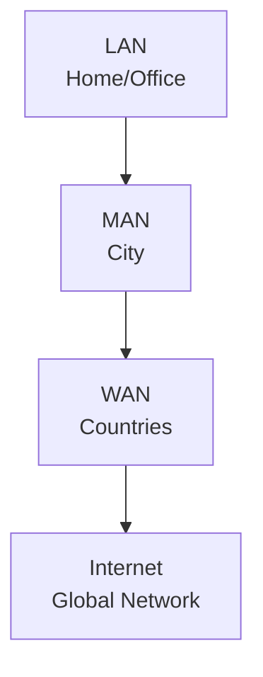

## Networking Devices 🛠️

- **Modem**:
    - Converts **digital signals** to **analog** and vice versa (e.g., for telephone lines).
    - **Hinglish**: "Modem digital data ko electrical signal mein badalta hai, taki Internet chal sake!"
    - **Example**: Converts your ISP’s signal to data your router uses.
- **Router**:
    - Routes **data packets** based on **IP addresses** at the **Network Layer**.
    - **Hinglish**: "Router bolta hai, yeh packet kahan bhejna hai, IP address dekho!"
    - **My Input**: Routers use routing tables to find the best path for packets.
- **Repeater**:
    - Regenerates weak signals at the **Physical Layer** without amplifying them.
    - **Hinglish**: "Repeater signal ko fresh karta hai jab woh weak ho jata hai."
    - **Details**: Two-port device, copies signal bit by bit.
- **Hub**:
    - Multi-port repeater, connects multiple devices in a **star topology**.
    - **Limitation**: No filtering; sends data to all devices, causing collisions.
    - **Hinglish**: "Hub sab devices ko data bhej deta hai, par smart nahi hai!"
- **Bridge**:
    - Operates at **Data Link Layer**, filters data using **MAC addresses**.
    - **Hinglish**: "Bridge MAC address dekhta hai aur decide karta hai kisko data bhejna hai."
- **Switch**:
    - Multi-port bridge, performs error checking and efficient forwarding at **Data Link Layer**.
    - **Hinglish**: "Switch bridge ka bada bhai hai – fast aur efficient!"
- **Gateway**:
    - Connects networks using different protocols.
    - **Hinglish**: "Gateway do alag-alag networks ko jodta hai, jaise translator!"
- **Brouter**:
    - Combines bridge and router functions, operating at both Data Link and Network Layers.
- **My Input**: Switches are preferred over hubs in modern LANs due to efficiency and reduced collisions.

### Table: Networking Devices 📋

| **Device** | **Layer** | **Function** | **Key Feature** |
| --- | --- | --- | --- |
| Modem | Physical | Converts digital to analog signals | Enables ISP connectivity |
| Router | Network | Routes packets using IP addresses | Finds best path for data |
| Repeater | Physical | Regenerates weak signals | Two-port device, no amplification |
| Hub | Physical | Multi-port repeater, connects devices | No filtering, high collisions |
| Bridge | Data Link | Filters data using MAC addresses | Reduces network congestion |
| Switch | Data Link | Multi-port bridge, error checking | Efficient, reduces collisions |
| Gateway | Varies | Connects different protocol networks | Acts as a protocol translator |
| Brouter | Data Link/Network | Combines bridge and router functions | Hybrid functionality |

## Network Topologies 📐

- **Definition**: The arrangement of devices in a network.
- **Hinglish**: "Topology bolta hai kaise computers ek doosre se connect hote hain!"
- **Types**:
    1. **Bus Topology**:
        - All devices connect to a single cable (backbone–

System: * Today's date and time is 01:17 AM IST on Friday, June 20, 2025.

# Transport Layer and Protocols 📡

## Recap: HTTP and Application Layer Protocols 🌐

- **HTTP Overview**:
    - **HyperText Transfer Protocol (HTTP)** is an **application layer protocol** for web communication.
    - Operates in a **client-server model**: Client sends a request (e.g., to [`google.com`](http://google.com/)), server responds with data (e.g., HTML, images).
    - **Hinglish**: "HTTP bolta hai, client server se data mangta hai, server bolta hai, ‘Le, yeh webpage!’"
    - Uses **TCP** (Transport Layer protocol) for reliable data delivery.
    - **Stateless Protocol**: Does not store client state by default (each request is independent).
    - **My Input**: HTTP/1.1 introduced persistent connections (`keep-alive`) to reduce overhead; HTTP/2 and HTTP/3 (uses UDP) improve performance further.
- **HTTP Methods**:
    - **GET**: Requests data from the server (e.g., load a webpage).
    - **POST**: Sends data to the server (e.g., form submission, username/password).
    - **PUT**: Updates data at a specific server location.
    - **DELETE**: Removes data from the server.
    - **Hinglish**: "GET bolta hai, ‘Mujhe data de!’ POST bolta hai, ‘Yeh data le, server!’"
    - **My Input**: GET is idempotent (repeatable without side effects); POST is not (e.g., submitting a form twice may create duplicates).
- **HTTP Headers**:
    - **Request Headers**: Sent by client (e.g., `Accept-Language: en`, `Accept-Encoding: gzip`, `Connection: keep-alive`).
        - `Accept-Language`: Preferred language (e.g., English).
        - `Accept-Encoding`: Supported compression (e.g., gzip).
        - `Connection: keep-alive`: Requests persistent connection to avoid reopening TCP.
    - **Response Headers**: Sent by server (e.g., `Content-Length`, `Content-Type`, `Set-Cookie`).
    - **Hinglish**: "Headers jaise envelope pe address hota hai – client aur server ke beech info batata hai!"
    - **Example**: Inspecting [`google.com`](http://google.com/) in browser’s Network tab (F12) shows headers, methods, and status codes.
    - **My Input**: Headers are critical for debugging (e.g., cache issues, CORS errors) and optimizing web performance.
- **HTTP Status Codes**:
    - **100–199**: Informational (e.g., request processing).
    - **200–299**: Success (e.g., **200 OK** = request successful).
    - **300–399**: Redirection (e.g., **301 Moved Permanently**).
    - **400–499**: Client Error (e.g., **404 Not Found**, **400 Bad Request**).
    - **500–599**: Server Error (e.g., **500 Internal Server Error**).
    - **Hinglish**: "200 matlab sab theek, 404 matlab page nahi mila, 500 matlab server kharab!"
    - **My Input**: Status codes are crucial for diagnosing issues in web apps (e.g., 429 Too Many Requests for rate-limiting).
- **Cookies**:
    - **Definition**: Small text files stored in the browser to maintain state in stateless HTTP.
    - **How it Works**:
        - Server sends a `Set-Cookie` header with a unique string (e.g., user ID).
        - Client includes cookie in subsequent requests to identify itself.
        - **Hinglish**: "Cookie jaise ID card hai – server bolta hai, ‘Yeh le, apna identity save kar!’"
        - Example: Logging into Amazon keeps your cart/session active even after closing the browser.
    - **Expiration**: Cookies have an expiry date (e.g., session cookies expire when browser closes).
    - **Third-Party Cookies**: Set by domains other than the visited site (e.g., ads on [`flipkart.com`](http://flipkart.com/)).
        - **Privacy Concern**: Used for tracking; can be disabled in browsers (e.g., Safari).
        - **Hinglish**: "Third-party cookies ads ke liye track karte hain – thodi privacy issue hai!"
    - **My Input**: Cookies are vital for session management but raise GDPR/CCPA compliance issues. Use tools like `document.cookie` to inspect them.
- **URLs and Structure**:
    - **Definition**: Uniform Resource Locator (URL) identifies a resource on the web.
    - **Components**:
        - **Protocol**: `https://` (secure HTTP).
        - **Domain**: [`google.com`](http://google.com/) (resolves to an IP address).
        - **Path**: `/images/branding/googlelogo/2x/googlelogo_color_92x30dp.png` (specific resource).
        - **Query Parameters**: `?type=i` (arguments after `?` for dynamic content).
        - **Hinglish**: "URL jaise address hai – protocol batata hai kaise jana, domain kahan jana, path kya lena!"
    - **Example**: [`https://www.youtube.com/watch?v=abc123`](https://www.youtube.com/watch?v=abc123) (video ID as query parameter).
    - **My Input**: Query parameters enable dynamic web apps (e.g., search filters on e-commerce sites).

### Diagram: HTTP Request-Response 🖼️

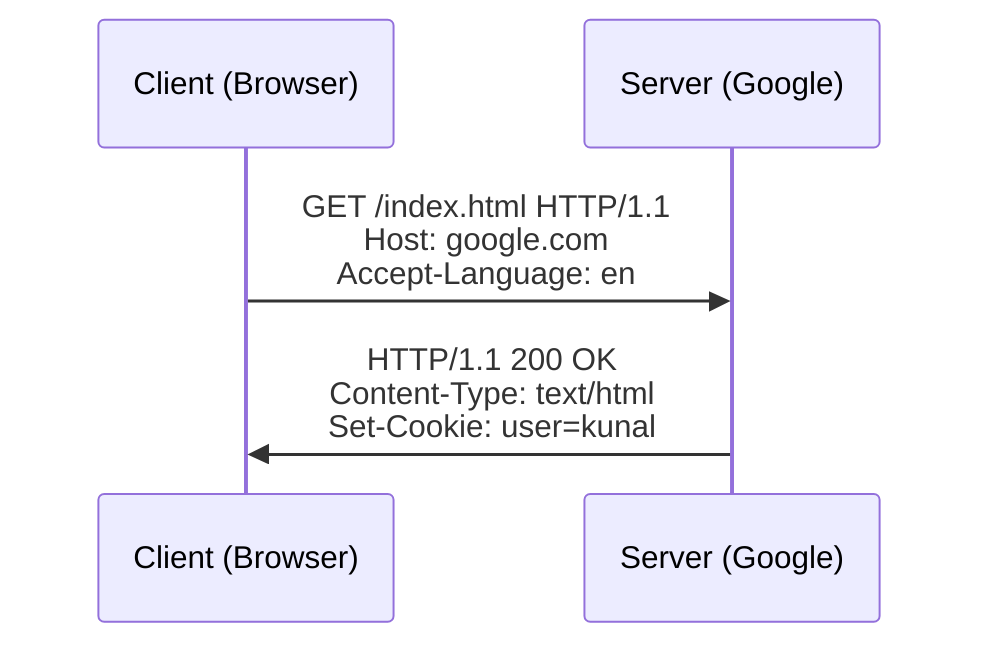

## Email Protocols 📧

- **Simple Mail Transfer Protocol (SMTP)**:
    - **Purpose**: Sends emails from client to server or between servers.
    - **Transport Layer**: Uses **TCP** for reliable delivery (no data loss).
    - **Hinglish**: "SMTP email bhejne ka protocol hai – sender ka server receiver ke server se baat karta hai!"
    - **Flow**:
        1. Sender’s client sends email to sender’s SMTP server (e.g., [`yahoo.com`](http://yahoo.com/)).
        2. Sender’s SMTP server connects to receiver’s SMTP server (e.g., [`gmail.com`](http://gmail.com/)).
        3. Email is stored until receiver downloads it.
        - If both sender and receiver use the same domain (e.g., [`gmail.com`](http://gmail.com/)), no external server connection is needed.
    - **Error Handling**: If receiver’s server is offline, sender’s server retries for days before giving up.
    - **My Input**: SMTP uses port 25 (or 587 for secure submission); check server details with `nslookup -type=mx [gmail.com](http://gmail.com/)`.
- **Post Office Protocol (POP3)**:
    - **Purpose**: Downloads emails from server to client.
    - **Transport Layer**: Uses **TCP** on port 110.
    - **Hinglish**: "POP3 email server se download karta hai – lekin sync nahi hota!"
    - **Flow**:
        1. Client connects to POP3 server, authenticates (username/password).
        2. Client requests new/unread emails.
        3. Emails are downloaded; client can delete them from server or keep copies.
    - **Limitation**: Does not sync folders (e.g., Sent, Drafts); emails downloaded to one device are unavailable on others if deleted from server.
    - **My Input**: POP3 is outdated for multi-device use due to lack of synchronization.
- **Internet Message Access Protocol (IMAP)**:
    - **Purpose**: Accesses emails on server, allowing multi-device synchronization.
    - **Transport Layer**: Uses **TCP** on port 143 (or 993 for secure IMAP).
    - **Hinglish**: "IMAP email server pe rakhta hai, sab devices pe sync hota hai!"
    - **Flow**:
        - Emails remain on server; local copies are cached on devices.
        - Actions (e.g., delete on iPhone) sync across devices (e.g., Mac, iPad).
    - **Advantage**: Syncs folders (Sent, Drafts) and supports multiple devices.
    - **My Input**: IMAP is standard for modern email clients (e.g., Gmail, Outlook).

### Diagram: Email Flow (SMTP + IMAP) 🖼️

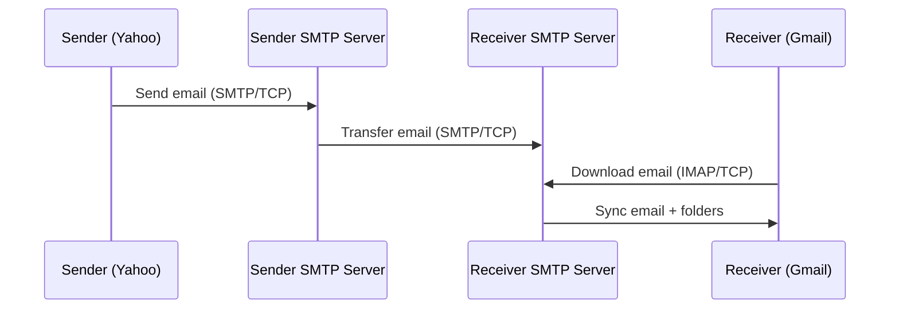

## Domain Name System (DNS) 🌐

- **Definition**: Maps domain names (e.g., [`google.com`](http://google.com/)) to IP addresses (e.g., `172.217.167.78`).
- **Hinglish**: "DNS jaise phone book hai – domain name se IP address dhundta hai!"
- **Why Needed?**: Humans use readable domain names; computers need IP addresses.
- **Components**:
    - **Subdomain**: [`mail.google.com`](http://mail.google.com/) (part of main domain).
    - **Second-Level Domain**: `google` (main brand/organization).
    - **Top-Level Domain (TLD)**: `.com`, `.org`, `.edu`, `.in` (generic or country-specific).
    - **Root DNS Servers**: First point of contact, managed by organizations (e.g., Internet Systems Consortium).
- **How DNS Works**:
    1. **Local Cache**: Browser/OS checks local cache for IP address.
    2. **Local DNS Server**: If not in cache, queries ISP’s DNS server.
    3. **Root DNS Server**: If ISP doesn’t know, queries root server (e.g., [`root-servers.org`](http://root-servers.org/)).
    4. **TLD Server**: Root server directs to TLD server (e.g., `.com`).
    5. **Authoritative Server**: TLD server provides IP address for domain (e.g., [`google.com`](http://google.com/)).
    6. **Connection**: Browser connects to server’s IP address.
    - **Hinglish**: "[Google.com](http://google.com/) type karo, pehle local cache check, phir ISP, phir root, TLD, aur IP mil jata hai!"
- **Management**:
    - **ICANN (Internet Corporation for Assigned Names and Numbers)**: Manages TLDs and domain registrations.
    - **Domain Rental**: Domains are rented (not owned) via registrars like GoDaddy; fees paid to ICANN.
    - **Example**: `.google` (Google), `.fire` (Amazon) are custom TLDs.
- **Tools**:
    - **dig**: DNS lookup utility (`dig [gmail.com](http://gmail.com/)`).
    - **nslookup**: Queries DNS records (e.g., `nslookup -type=mx [gmail.com](http://gmail.com/)` for SMTP servers).
- **My Input**: DNS uses **UDP** for speed (port 53); caching reduces lookup time but can cause stale data issues.

### Diagram: DNS Resolution 🖼️

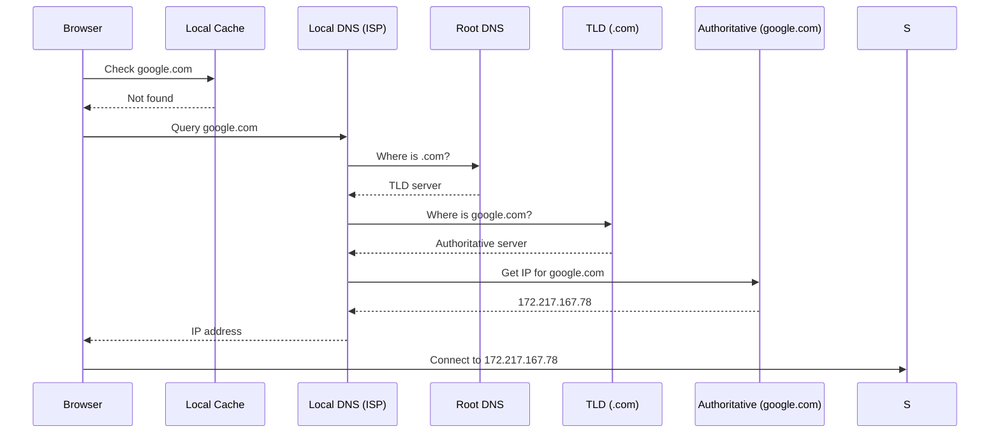

## Transport Layer Deep Dive 🚚

- **Role of Transport Layer**:
    - Transfers data between **applications** within a device (application layer ↔ network layer).
    - **Hinglish**: "Transport layer bolta hai, network se data application tak pahunchao, aur application se network tak!"
    - **Contrast with Network Layer**:
        - **Network Layer**: Moves data between devices (e.g., from your computer to your friend’s).
        - **Transport Layer**: Ensures data reaches the correct application (e.g., WhatsApp, Skype) within a device.
    - **Analogy**:
        - Sending a package internationally:
            - **Network Layer**: Courier company delivers package from your country to your friend’s country.
            - **Transport Layer**: Ensures package reaches the right person (application) in your friend’s house.
        - **Hinglish**: "Network layer package country se country bhejta hai, transport layer ghar ke andar sahi app tak!"
- **Key Functions**:
    1. **Multiplexing**: Combines data from multiple applications (e.g., WhatsApp, Skype, email) into a single stream for the network layer.
    2. **Demultiplexing**: Separates incoming data to deliver to the correct application.
    3. **Port Numbers**: Identifies applications (e.g., HTTP: 80, SMTP: 25).
    4. **Congestion Control**: Manages network traffic to prevent packet loss.
    5. **Error Control**: Detects and corrects data corruption/loss (in TCP).
    - **Hinglish**: "Multiplexing jaise ek box mein sab apps ka data daal do, demultiplexing usko alag-alag apps tak bhej do!"
- **Mechanisms**:
    - **Sockets**: Software interfaces connecting applications to the network.
        - **Hinglish**: "Socket jaise app aur network ke beech ka darwaza hai!"
    - **Port Numbers**:
        - **Source Port**: Sender’s application (e.g., ephemeral port for browser).
        - **Destination Port**: Receiver’s application (e.g., 80 for HTTP server).
        - **Ephemeral Ports**: Temporary ports for client-side processes (e.g., multiple Chrome tabs).
    - **Segments**: Data chunks with headers (e.g., port numbers, checksums).
    - **Checksums**: Verify data integrity (detect corruption).
    - **Sequence Numbers**: Ensure data arrives in order.
    - **Timers**: Track packet delivery; retransmit if timed out.

### Diagram: Multiplexing and Demultiplexing 🖼️

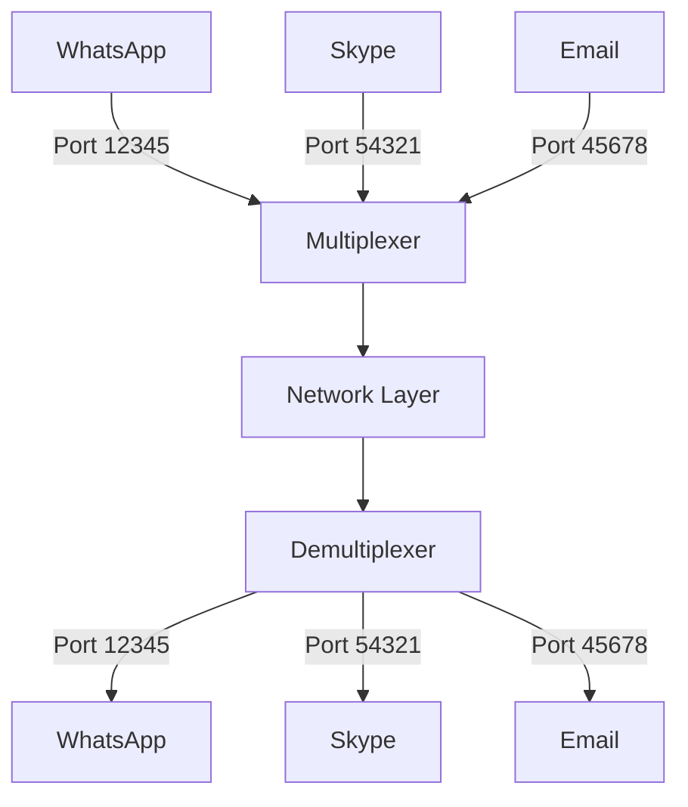

## Transport Layer Protocols: UDP and TCP 🔄

### User Datagram Protocol (UDP) 🌬️

- **Definition**: Connectionless transport layer protocol for fast, unreliable data transfer.
- **Hinglish**: "UDP bolta hai, ‘Data bhejo, par guarantee nahi hai!’"
- **Characteristics**:
    - **Connectionless**: No handshake; sends data immediately.
    - **Unreliable**: No guarantee of delivery, order, or integrity.
    - **Fast**: Minimal overhead (no connection setup or retransmission).
    - **Checksums**: Detects corruption but doesn’t correct it.
- **Packet Structure (Datagram)**:
    - **Source Port** (2 bytes): Sender’s port.
    - **Destination Port** (2 bytes): Receiver’s port.
    - **Length** (2 bytes): Total datagram size.
    - **Checksum** (2 bytes): Data integrity check.
    - **Data**: Payload (up to 65,528 bytes = 2¹⁶ - 8 bytes header).
- **Use Cases**:
    - **Video Conferencing**: Speed matters; minor packet loss is tolerable (e.g., Zoom).
    - **Gaming**: Fast response critical (e.g., online multiplayer games).
    - **DNS**: Quick lookups (e.g., resolving [`google.com`](http://google.com/)).
    - **Hinglish**: "UDP video call aur gaming ke liye perfect hai – thodi loss chalta hai!"
- **Tools**: Use `tcpdump -c 5` to capture UDP packets (shows IP, port, sequence, length).
- **My Input**: UDP’s simplicity makes it ideal for real-time apps but unsuitable for critical data (e.g., file transfers).

### Transmission Control Protocol (TCP) 🛡️

- **Definition**: Connection-oriented transport layer protocol for reliable data transfer.
- **Hinglish**: "TCP bolta hai, ‘Data poora aur sahi order mein pahunchaunga!’"
- **Characteristics**:
    - **Connection-Oriented**: Establishes connection via **three-way handshake** before data transfer.
    - **Reliable**: Ensures delivery, order, and integrity using acknowledgments, sequence numbers, and retransmissions.
    - **Congestion Control**: Adjusts sending rate to avoid network overload.
    - **Error Control**: Detects and corrects data loss/corruption.
    - **Full Duplex**: Simultaneous two-way communication (e.g., send/receive files).
    - **Point-to-Point**: One TCP connection serves two endpoints (no multicast).
- **Segment Structure**:
    - **Source/Destination Ports**: Identify applications.
    - **Sequence Number**: Tracks data order.
    - **Acknowledgment Number**: Confirms received data.
    - **Checksum**: Verifies integrity.
    - **Data**: Payload (variable size).
- **Three-Way Handshake**:
    1. Client sends **SYN** (synchronize) to server.
    2. Server responds with **SYN-ACK** (synchronize-acknowledgment).
    3. Client sends **ACK** (acknowledgment); connection established.
    - **Hinglish**: "Client bolta hai, ‘Connection chalu karo!’ Server bolta hai, ‘OK, chalu!’ Phir client bolta hai, ‘Done!’"
- **Use Cases**:
    - **Web Browsing**: HTTP/HTTPS (reliable webpage delivery).
    - **Email**: SMTP, POP3, IMAP (no data loss).
    - **File Transfer**: FTP, SFTP (complete file delivery).
    - **Hinglish**: "TCP email, web, aur file transfer ke liye hai – 100% guarantee!"
- **My Input**: TCP’s overhead (handshake, retransmissions) makes it slower than UDP but essential for reliability.

### Diagram: TCP Three-Way Handshake 🖼️

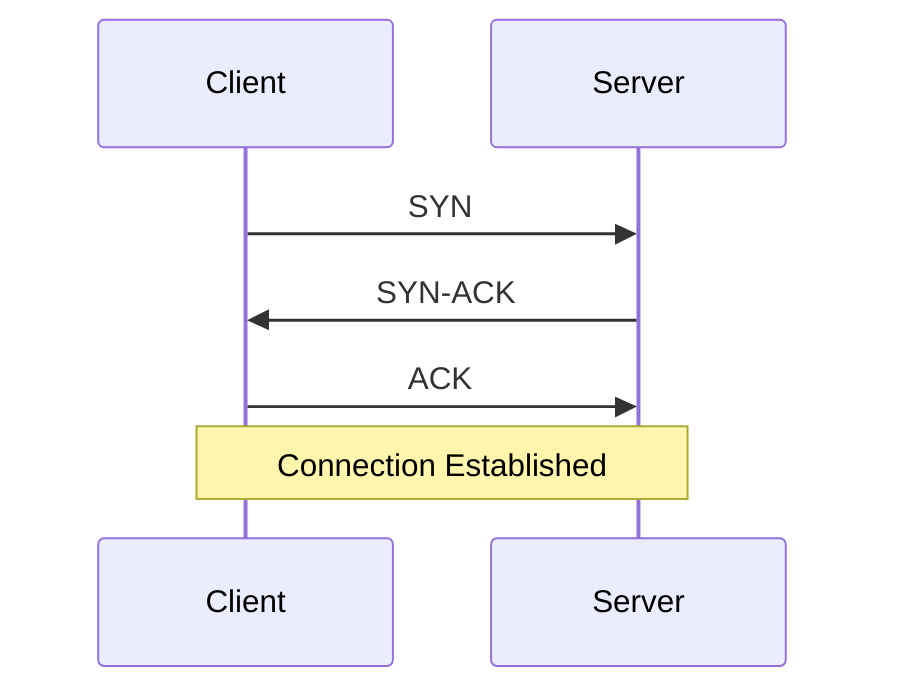

### Comparison: TCP vs. UDP 📊

| **Feature** | **TCP** | **UDP** |
| --- | --- | --- |
| Connection | Connection-oriented (handshake) | Connectionless |
| Reliability | Ensures delivery, order, integrity | No delivery/order guarantee |
| Speed | Slower (overhead) | Faster (minimal overhead) |
| Congestion Control | Yes | No |
| Error Control | Yes (retransmissions) | Checksum only (no correction) |
| Use Cases | HTTP, email, file transfer | Video conferencing, gaming, DNS |
| Packet Name | Segment | Datagram |

## Interview Angle: GATE/Placement Prep 🚀

- **Key Questions**:
    - **Q1**: What is the difference between TCP and UDP?
        - **A**: TCP is connection-oriented, reliable, and used for applications like email; UDP is connectionless, faster, and used for real-time apps like gaming.
    - **Q2**: Explain the TCP three-way handshake.
        - **A**: Client sends SYN, server responds with SYN-ACK, client sends ACK to establish a connection.
    - **Q3**: How does HTTP maintain state despite being stateless?
        - **A**: Uses cookies to store client state (e.g., session ID) in the browser.
    - **Q4**: What is DNS, and how does it resolve a domain name?
        - **A**: DNS maps domain names to IP addresses via local cache, ISP, root, TLD, and authoritative servers.
    - **Q5**: Why does SMTP use TCP and not UDP?
        - **A**: SMTP requires reliable delivery of emails, which TCP ensures; UDP allows data loss.
- **MCQ Traps**:
    - Don’t confuse **HTTP** (application layer) with **TCP** (transport layer).
    - UDP uses **datagrams**, not segments (TCP’s term).
    - DNS primarily uses **UDP**, not TCP (except for large responses).
- **Trade-offs**:
    - **TCP vs. UDP**: TCP is reliable but slow; UDP is fast but unreliable.
    - **POP3 vs. IMAP**: POP3 is simple but lacks sync; IMAP supports multi-device sync.
    - **Cookies**: Enable state but pose privacy risks (e.g., third-party tracking).

### GATE/Placement Summary Table 📋

| **Concept** | **Key Point** | **Interview Tip** |
| --- | --- | --- |
| HTTP | Application layer protocol for web; stateless, uses TCP | Mention methods (GET, POST) and cookies |
| Cookies | Store state in browser for session management | Discuss privacy (third-party cookies) |
| SMTP | Sends emails using TCP; reliable delivery | Link to TCP for reliability |
| POP3/IMAP | POP3 downloads emails (no sync); IMAP syncs across devices | Highlight IMAP’s multi-device advantage |
| DNS | Maps domain names to IP addresses via hierarchical servers | Explain resolution steps (cache → root → TLD) |
| Transport Layer | Moves data between applications and network within a device | Contrast with network layer (device-to-device) |
| UDP | Fast, connectionless; used for video, gaming, DNS | Stress speed over reliability |
| TCP | Reliable, connection-oriented; used for HTTP, email | Describe three-way handshake, sequence numbers |

# Network, Data Link, and Physical Layers 📡

## Recap: TCP Three-Way Handshake (Transport Layer) 🤝

- **Definition**: Establishes a reliable connection between client and server in TCP using three steps.
- **Hinglish**: "TCP bolta hai, ‘Pehle connection confirm karo, phir data bhejo!’"
- **Steps**:
    1. **Client sends SYN (Synchronize)**:
        - Includes a **SYN flag** (indicates new connection) and a random **sequence number** (e.g., 32).
        - Random sequence numbers enhance security to prevent guessing by attackers.
        - **Hinglish**: "Client bolta hai, ‘Connection shuru kar, yeh mera number 32!’"
    2. **Server responds with SYN-ACK**:
        - Sends **SYN flag** (for its own connection), **ACK flag** (acknowledges client’s SYN), and a new sequence number (e.g., derived from client’s 32 via mathematical calculation, say 56).
        - Acknowledgment number = Client’s sequence number + 1 (e.g., 32 + 1 = 33).
        - **Hinglish**: "Server bolta hai, ‘Okay, mera number 56, tera 32 confirm!’"
    3. **Client sends ACK**:
        - Sends **ACK flag**, updated sequence number (e.g., 32 + 1 = 33), and acknowledgment number (e.g., server’s sequence number 56 + 1 = 57).
        - Connection is established.
        - **Hinglish**: "Client bolta hai, ‘Done, tera 56 confirm, ab baat shuru!’"
- **Other Flags**:
    - **RST (Reset)**: Terminates connection abruptly (e.g., error).
    - **FIN (Finish)**: Gracefully closes connection.
- **Packet Structure**: Includes source/destination ports, sequence/acknowledgment numbers, flags, checksum.
- **My Input**: Three-way handshake ensures both sides agree on sequence numbers and are ready for data transfer. Common interview question: “Why three steps, not two?” (Answer: Ensures bidirectional synchronization.)

### Diagram: TCP Three-Way Handshake 🖼️

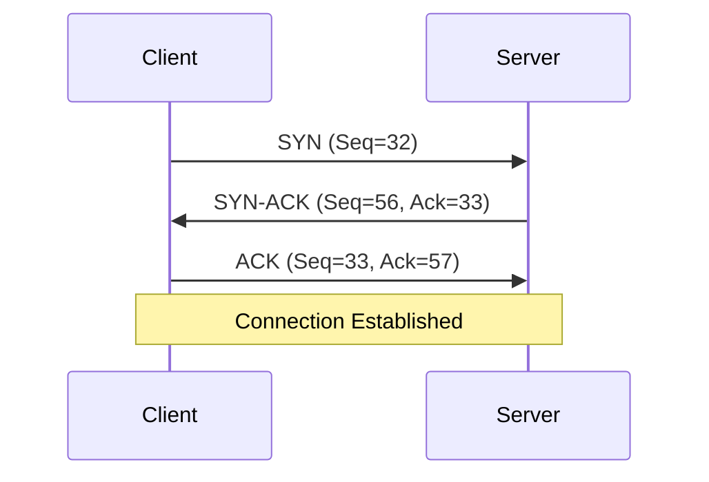

## Network Layer Deep Dive 🌐

- **Role**: Transfers **packets** between devices across networks (e.g., from your computer to a server in another country).
- **Hinglish**: "Network layer bolta hai, ‘Data ek device se doosre tak bhejo, chahe duniya ke kisi kone mein ho!’"
- **Contrast with Transport Layer**:
    - **Transport Layer**: Moves data within a device (network ↔ application).
    - **Network Layer**: Moves data between devices (router-to-router).
- **Key Device**: **Routers** forward packets using IP addresses.
- **Data Unit**: **Packets** (vs. **segments** in transport layer, **frames** in data link layer).

### Routing and Forwarding 📍

- **Routing**: Process of determining the path for packets across networks.
- **Forwarding**: Action of sending packets to the next hop based on a router’s **forwarding table**.
- **Hinglish**: "Routing table jaise map hai, forwarding table uska shortcut version!"
- **Forwarding Table**:
    - Subset of **routing table**, containing one optimal path per destination.
    - Maps destination IP addresses to next-hop router.
    - **Example**: Packet for IP `192.168.1.100` → Send to router at `10.0.0.2`.
- **Hop-by-Hop Forwarding**:
    - Each router checks packet’s destination IP, consults forwarding table, and sends to next router.
    - **Hinglish**: "Packet ek router se doosre router tak hop karta hai, jaise relay race!"
- **Routing Table Creation**:
    - Managed by **control plane** in the network layer.
    - **Static Routing**: Manually configured paths (time-consuming, non-adaptive).
    - **Dynamic Routing**: Uses algorithms (e.g., Bellman-Ford, Dijkstra) to adapt to network changes.
        - **Hinglish**: "Dynamic routing bolta hai, ‘Network badla? Main apne aap update kar lunga!’"
    - **My Input**: Dynamic routing protocols (e.g., OSPF, BGP) are critical for Internet scalability.

### Diagram: Hop-by-Hop Forwarding 🖼️

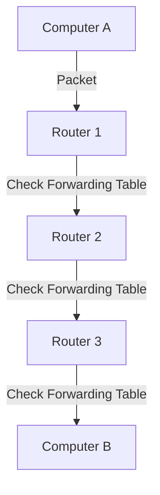

### Internet Protocol (IP) 📡

- **Definition**: Network layer protocol for addressing and routing packets.
- **Hinglish**: "IP bolta hai, ‘Har device ka address do, main packet pahuncha dunga!’"
- **IP Addresses**:
    - **IPv4**: 32-bit address (e.g., `192.168.1.1`), ~4.3 billion unique addresses (2³²).
        - Format: Four 8-bit numbers (0–255) separated by dots.
        - Example: `5.6.9.4` → Binary: `00000101.00000110.00001001.00000100`.
    - **IPv6**: 128-bit address (e.g., `abfe:f001:3210:9182::`), ~3.4×10³⁸ addresses.
        - Format: Eight 16-bit hexadecimal blocks separated by colons.
        - Shorthand: Omit leading zeros, collapse consecutive zeros (e.g., `::` for multiple zero blocks).
        - Example: `abfe:f001:3210:9182:0000:0000:0000:0000` → `abfe:f001:3210:9182::`.
    - **IPv4 Limitations**: Address exhaustion due to Internet growth (smartphones, IoT).
    - **IPv6 Challenges**: Not backward compatible with IPv4; requires hardware upgrades.
    - **My Input**: IPv6 adoption is slow (~40% globally in 2025); dual-stack networks (IPv4+IPv6) are common.

### IP Address Classes and Subnetting 🏷️

- **Classes**: Divide IPv4 address space for different network sizes.
    - **Class A**: `0.0.0.0`–`127.255.255.255` (large networks, e.g., ISPs).
    - **Class B**: `128.0.0.0`–`191.255.255.255` (medium networks, e.g., universities).
    - **Class C**: `192.0.0.0`–`223.255.255.255` (small networks, e.g., homes).
    - **Class D**: `224.0.0.0`–`239.255.255.255` (multicast).
    - **Class E**: `240.0.0.0`–`255.255.255.255` (reserved).
    - **Hinglish**: "Class A bade networks ke liye, Class C chhote ghar ke liye!"
- **Subnetting**: Divides a network into smaller subnetworks (subnets).
    - **Network Address**: Identifies the network (e.g., `192.168.1.0`).
    - **Host Address**: Identifies a device within the network (e.g., `192.168.1.100`).
    - **Subnet Mask**: Separates network and host parts (e.g., `255.255.255.0` for Class C).
        - Example: `192.168.1.0/24` → 24 bits for network, 8 bits for hosts (256 addresses).
    - **Variable-Length Subnet Masking (VLSM)**: Flexible subnet sizes (e.g., `/31` for 2 hosts).
    - **Hinglish**: "Subnet mask bolta hai, ‘Yeh network ka part hai, yeh device ka!’"
- **Allocation**:
    - Managed by **Internet Engineering Task Force (IETF)** and regional registries (e.g., APNIC).
    - Initially first-come, first-serve (e.g., MIT got Class A); now region-based to minimize hops.
- **Reserved Addresses**:
    - **Loopback**: `127.0.0.0/8` (e.g., `127.0.0.1` = [localhost](http://localhost/) for testing).
        - **Hinglish**: "[Localhost](http://localhost/) jaise apne hi ghar ka server hai!"
- **My Input**: Subnetting optimizes address usage; CIDR (Classless Inter-Domain Routing) replaced rigid classes.

### IP Packet Structure 📦

- **Header**: 20 bytes, includes:
    - **IP Version**: 4 (IPv4) or 6 (IPv6).
    - **Source/Destination IP**: Sender and receiver addresses.
    - **Total Length**: Packet size.
    - **Identification**: Packet ID for reassembly.
    - **Flags**: Control fragmentation.
    - **Time to Live (TTL)**: Maximum hops (e.g., 60); prevents infinite loops.
    - **Protocol**: Next layer protocol (e.g., TCP=6, UDP=17).
    - **Checksum**: Verifies header integrity.
- **Data**: Payload from transport layer.
- **TTL Example**: `ping [google.com](http://google.com/)` shows TTL (e.g., 60 hops); packet dropped if TTL reaches 0.
- **Hinglish**: "TTL bolta hai, ‘Itne hops tak nahi pahuncha, toh packet drop kar do!’"
- **My Input**: Use `traceroute` to see TTL decrements per hop.

### Middle Boxes 🛡️

- **Definition**: Devices that process packets between end systems and routers.
- **Hinglish**: "Middle boxes jaise network ke bouncers hai – packets check karte hain!"
- **Types**:
    1. **Firewall**:
        - Filters packets based on rules (e.g., IP address, port, protocol, flags like SYN).
        - **Stateless Firewall**: No state tracking; evaluates each packet independently.
        - **Stateful Firewall**: Tracks connection state (e.g., allows responses for initiated connections).
        - **Hinglish**: "Firewall bolta hai, ‘Yeh packet allowed hai ya block karu?’"
        - Operates at network and transport layers.
    2. **Network Address Translator (NAT)**:
        - Maps private IP addresses (e.g., `10.0.0.1`) to public IPs (e.g., `150.150.0.1`).
        - Conserves IPv4 addresses by allowing multiple devices to share one public IP.
        - Modifies packet headers (source/destination IP, checksum).
        - **Hinglish**: "NAT bolta hai, ‘Tera private IP chhupa dunga, public IP dikhayega!’"
        - Use Cases: Home routers, enterprise networks, load balancing.
- **My Input**: Firewalls prevent unauthorized access (e.g., DDoS mitigation); NAT enables private networks but complicates peer-to-peer apps.

## Data Link Layer Deep Dive 🔗

- **Role**: Transfers **frames** between directly connected devices over a physical link.
- **Hinglish**: "Data link layer bolta hai, ‘Router se device tak frame bhejo, physical wire pe!’"
- **Data Unit**: **Frames** (vs. packets in network layer, segments in transport layer).
- **Key Functions**:
    - **Framing**: Encapsulates packets into frames.
    - **Addressing**: Uses **MAC addresses** (data link layer addresses).
    - **Error Detection**: Checks for corruption (e.g., CRC).
    - **Access Control**: Manages shared medium access (e.g., Ethernet).
- **Key Protocol**: **Address Resolution Protocol (ARP)** maps IP addresses to MAC addresses.
- **Devices**: Switches, bridges, routers (at data link layer).

### MAC Addresses 🏷️

- **Definition**: 48-bit (12-digit hexadecimal) unique identifier for network interfaces.
    - Example: `00:1A:2B:3C:4D:5E`.
    - **Hinglish**: "MAC address jaise device ka permanent ID card hai!"
- **Scope**: Identifies devices within a LAN (vs. IP addresses for global routing).
- **Components**: Wi-Fi, Ethernet, Bluetooth interfaces have distinct MAC addresses.
- **Use Case**: Routers use MAC addresses to deliver frames to the correct device in a LAN.
- **Commands**:
    - Linux: `ifconfig` or `ip link` to view MAC address.
    - Windows: `ipconfig /all`.
- **My Input**: MAC addresses are burned into hardware but can be spoofed; used for LAN-level filtering (e.g., block devices).

### Address Resolution Protocol (ARP) 🔍

- **Purpose**: Maps IP addresses to MAC addresses within a LAN.
- **Hinglish**: "ARP bolta hai, ‘IP address ka MAC address bata, LAN mein kaun hai yeh?’"
- **Process**:
    1. Device A (e.g., `192.168.1.1`) wants to send data to Device B (e.g., `192.168.1.2`).
    2. Device A checks **ARP cache** for Device B’s MAC address.
    3. If not found, Device A broadcasts an **ARP request** frame:
        - Contains sender’s IP/MAC and target’s IP.
        - Sent to all devices in the LAN.
    4. Device B responds with an **ARP reply** containing its MAC address.
    5. Device A updates ARP cache and sends frame to Device B’s MAC address.
- **Frame Structure**:
    - Sender’s IP/MAC address.
    - Destination’s IP address (MAC unknown in request).
    - Payload (ARP message).
- **My Input**: ARP cache poisoning is a security risk; use `arp -a` to view cache.

### Diagram: ARP Process 🖼️

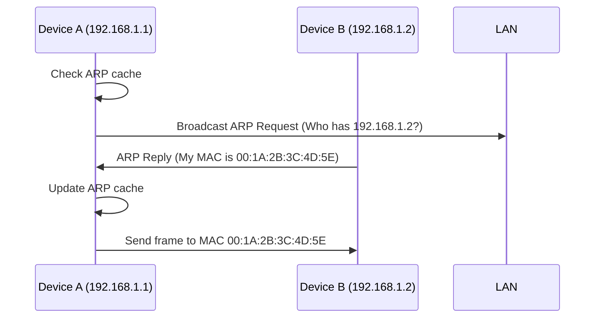

### Dynamic Host Configuration Protocol (DHCP) 📋

- **Purpose**: Automatically assigns IP addresses to devices in a network.
- **Hinglish**: "DHCP bolta hai, ‘Naya device? Le, tera IP address!’"
- **Process**:
    1. New device connects to network (e.g., joins Wi-Fi).
    2. Device sends **DHCP Discover** broadcast to find DHCP server.
    3. DHCP server responds with **DHCP Offer** (available IP address).
    4. Device sends **DHCP Request** to accept the IP.
    5. Server sends **DHCP ACK** to confirm assignment.
- **Pool**: DHCP server maintains a pool of IP addresses (e.g., `192.168.1.100`–`192.168.1.200`).
- **My Input**: DHCP leases IPs temporarily; conflicts arise if static IPs overlap with DHCP pool.

## Physical Layer Deep Dive ⚡️

- **Role**: Converts **frames** into electrical, optical, or radio signals for transmission over physical media.
- **Hinglish**: "Physical layer bolta hai, ‘Data ko zeros aur ones mein badlo, wire pe bhejo!’"
- **Components**:
    - **Media**: Cables (e.g., Ethernet, fiber), wireless (e.g., Wi-Fi, Bluetooth).
    - **Signals**: Voltage levels, light pulses, or radio waves.
    - **Hardware**: Network interface cards (NICs), connectors, transceivers.
- **Functions**:
    - Bit encoding/decoding.
    - Signal transmission/reception.
    - Synchronization of sender/receiver clocks.
- **My Input**: Physical layer standards (e.g., IEEE 802.3 for Ethernet) ensure interoperability; study signal modulation for deeper understanding.

## TCP/IP vs. OSI Model Comparison 📊

| **Layer** | **TCP/IP Model** | **OSI Model** | **Key Protocols/Devices** |
| --- | --- | --- | --- |
| Application | Application | Application, Presentation, Session | HTTP, SMTP, DNS |
| Transport | Transport | Transport | TCP, UDP |
| Network | Internet | Network | IP, routers |
| Data Link | Network Access | Data Link | ARP, MAC, switches |
| Physical | Network Access | Physical | Cables, NICs |

## Interview Angle: GATE/Placement Prep 🚀

- **Key Questions**:
    - **Q1**: Explain the TCP three-way handshake and why sequence numbers are random.
        - **A**: SYN, SYN-ACK, ACK establish connection; random sequence numbers prevent hacking.
    - **Q2**: What is the difference between routing and forwarding?
        - **A**: Routing builds paths (routing table); forwarding sends packets (forwarding table).
    - **Q3**: How does ARP work in a LAN?
        - **A**: Broadcasts request for MAC address, updates cache with reply.
    - **Q4**: Why was IPv6 introduced, and what are its challenges?
        - **A**: IPv4 address exhaustion; IPv6 not backward compatible, requires hardware upgrades.
    - **Q5**: What is the role of a firewall vs. NAT?
        - **A**: Firewall filters packets; NAT maps private IPs to public IPs.
- **MCQ Traps**:
    - **MAC vs. IP**: MAC is data link layer (LAN); IP is network layer (global).
    - **Segments vs. Packets vs. Frames**: Transport (segments), Network (packets), Data Link (frames).
    - **TTL**: Network layer (not transport or data link).
- **Trade-offs**:
    - **Static vs. Dynamic Routing**: Static is simple but rigid; dynamic adapts but complex.
    - **IPv4 vs. IPv6**: IPv4 is widely used but limited; IPv6 is future-proof but adoption is slow.
    - **Stateless vs. Stateful Firewall**: Stateless is faster; stateful is smarter.

### GATE/Placement Summary Table 📋

| **Concept** | **Key Point** | **Interview Tip** |
| --- | --- | --- |
| TCP Handshake | SYN, SYN-ACK, ACK establish connection | Mention random sequence numbers for security |
| Network Layer | Routes packets between devices using IP | Explain routing vs. forwarding |
| IP Addresses | IPv4 (32-bit), IPv6 (128-bit); subnetting divides networks | Discuss classes, subnet masks, CIDR |
| Middle Boxes | Firewalls filter packets; NAT maps IPs | Highlight NAT’s role in IPv4 conservation |
| Data Link Layer | Transfers frames using MAC addresses; ARP maps IP to MAC | Describe ARP cache and broadcast |
| DHCP | Assigns IP addresses dynamically | Explain DHCP Discover-Offer-Request-ACK |
| Physical Layer | Converts frames to signals (electrical, optical) | Mention media types (cables, wireless |