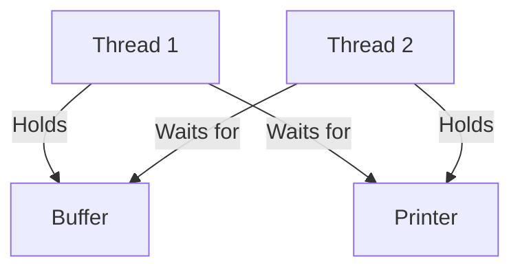

# Thread Concurrency and Multithreadi

## 1. Introduction to Thread Concurrency 📌

**What is it?**

**Thread concurrency** refers to the ability of a program to execute multiple instructions simultaneously within a single process by dividing it into **threads**. **Multithreading** is the technique of creating and managing these threads to achieve concurrency, improving performance and responsiveness in C++ applications on Windows.

**Core Idea**: A process (e.g., MS Word) is split into smaller, independent tasks (threads) like text editing and spell checking, running concurrently to make the app feel faster, like chefs in a kitchen handling multiple orders at once.

**Details**:

- **Module Scope**: Introduces thread concurrency, thread scheduling, multithreading advantages, and challenges (e.g., synchronization). Builds on lectures 3 and 4, which covered processes vs. threads and multitasking vs. multithreading.
- **Context**: Common in Windows apps like text editors, browsers, or servers, where multiple tasks (e.g., UI, background processing) run simultaneously.
- **Tools**: Use **threads** (`CreateThread` in Windows), **mutexes**, or **condition variables** in C++ for synchronization.

**Analogy**: Imagine MS Word as a restaurant (process) with chefs (threads) handling tasks like cooking (text editing), plating (formatting), and inventory checks (spell checking). Splitting these tasks into threads makes the restaurant run smoothly, serving customers (users) faster.

**Why is this important?**

- Enhances **responsiveness** in interactive apps (e.g., typing in Word doesn’t lag).
- Optimizes **resource sharing** within a process, reducing overhead compared to multiple processes.
- Critical for tech interviews (e.g., Amazon, Google) and real-world C++ apps on Windows (e.g., GUI apps, servers).
- **Video Vibe**: The instructor’s Hinglish MS Word analogy highlights threads as “lightweight processes” within a process, making apps “very fast” for users.

**Real Use Case**:

- **Text Editor**: A C++ app like Notepad++ uses threads for typing, auto-saving, and syntax highlighting, ensuring smooth user experience.
- **Web Browser**: Threads handle rendering, downloading, and user input in Chrome, preventing freezes.

## 2. The Thread Concurrency Problem 🔍

**What is it?**

A challenge in Operating Systems where a process is divided into **threads** to execute tasks concurrently, requiring coordination to avoid issues like **race conditions**, **deadlocks**, or **context switching overhead**.

**Players**:

- **Process**: A program in execution (e.g., MS Word).
- **Threads**: Lightweight sub-tasks within a process (e.g., text editing, spell checking).
- **CPU**: Executes threads, switching between them on single or multi-core systems.

**Goal**: Achieve concurrency by running threads simultaneously, improving responsiveness and efficiency while managing shared resources and synchronization.

**Why is this a problem?**

Three key issues:

1. **Race Conditions**: Threads accessing shared resources (e.g., a variable) simultaneously cause corruption.
2. **Synchronization Overhead**: Coordinating threads (e.g., using locks) adds complexity and delays.
3. **Context Switching**: Switching between threads consumes CPU, especially on single-core systems.

**How does it happen?**

- **Race Condition**: Two threads update a shared counter in MS Word, corrupting its value.
- **Deadlock**: Threads wait for each other’s resources (e.g., one holds a lock, another waits for it).
- **Overhead**: Frequent thread switches slow down a Windows app.

**Case Example**:

- **Scenario**: MS Word has threads for text editing and spell checking. Both access a shared buffer, causing a race condition (e.g., garbled text). Without synchronization, the app crashes.
- **Result**: Unreliable app behavior, frustrating users.
- **Video Context**: The instructor mentions “synchronization problems” and “bugs” (e.g., race conditions) when splitting a process into threads, using MS Word’s tasks as an example.


## 3. Threads and Multithreading 🛠️

**What is it?**

A **thread** is a lightweight process within a single process, capable of independent execution. **Multithreading** is the technique of creating multiple threads to execute tasks concurrently, sharing the process’s memory and resources.

**Why is this important?**

- Improves **responsiveness** (e.g., typing in Word doesn’t wait for spell checking).
- Enables **resource sharing** (threads share memory, unlike processes).
- Leverages **multi-core CPUs** for parallel execution.
- **Video Note**: The instructor defines threads as “lightweight processes” (LWPs) within a process, using MS Word’s text editor, spell checker, and formatter as thread examples.

**How does it work?**

- **Components**:
    - **Thread Control Block (TCB)**: Stores thread state (e.g., program counter, registers).
    - **Shared Memory**: Threads share the process’s address space (e.g., data, code).
    - **Windows APIs**: `CreateThread`, `WaitForSingleObject` for thread management.
- **Process**:
    - Divide a process into threads (e.g., MS Word → text editing, spell checking).
    - Schedule threads using OS algorithms (e.g., priority-based, Round Robin).
    - Synchronize threads to avoid conflicts (e.g., mutex for shared buffer).
- **Result**: Concurrent execution, faster response, efficient resource use.

**Key Differences: Thread vs. Process**:

| Aspect | Thread | Process |
| --- | --- | --- |
| **Definition** | Lightweight sub-task within a process | Independent program in execution |
| **Memory** | Shares process’s address space | Has separate address space |
| **Overhead** | Low (fast context switching) | High (slow creation/switching) |
| **Communication** | Easy (shared memory) | Complex (IPC, e.g., pipes) |
| **Isolation** | Less (shared resources) | High (independent) |
- **Video Note**: The instructor emphasizes threads share the “same address” (memory), unlike processes with “individual address” spaces, reducing overhead.

**Code Example**:

```cpp
#include <windows.h>
#include <iostream>
using namespace std;

DWORD WINAPI TextEditing(LPVOID arg) {
    int id = *(int*)arg;
    while (true) {
        cout << "Thread " << id << ": Editing text\n";
        Sleep(1000); // Simulate text editing
    }
    return 0;
}

DWORD WINAPI SpellChecking(LPVOID arg) {
    int id = *(int*)arg;
    while (true) {
        cout << "Thread " << id << ": Checking spelling\n";
        Sleep(1500); // Simulate spell checking
    }
    return 0;
}

int main() {
    int id1 = 1, id2 = 2;
    HANDLE threads[2];
    threads[0] = CreateThread(NULL, 0, TextEditing, &id1, 0, NULL);
    threads[1] = CreateThread(NULL, 0, SpellChecking, &id2, 0, NULL);
    Sleep(5000); // Run for 5 seconds
    TerminateThread(threads[0], 0);
    TerminateThread(threads[1], 0);
    CloseHandle(threads[0]);
    CloseHandle(threads[1]);
    cout << "Main: Done!\n";
    return 0;
}

```

**What it does**: Creates two threads in a process (simulating MS Word): one for text editing, one for spell checking. Threads run concurrently, printing their tasks.

**Run it**: Compile in Visual Studio; output shows threads executing simultaneously.

**Video Note**: Matches the instructor’s MS Word example, where threads for “text editor, spell checker, formatting” run independently, improving “user experience.”

**Case Example**:

- **Scenario**: MS Word splits into threads for typing and spell checking. Typing thread runs while spell checking runs in parallel, keeping the app responsive.
- **Result**: User types smoothly without waiting for spell checks.

**Real Use Case**:

- **Browser**: A C++ app like Chrome uses threads for rendering, JavaScript execution, and downloads, ensuring smooth browsing.
- **Game Engine**: Threads handle rendering, physics, and input, preventing lag.

**Common Errors**:

- **No Synchronization**: Threads corrupt shared data. **Fix**: Use mutexes.
- **Blocking**: One thread blocks others (e.g., I/O). **Fix**: Handle I/O in separate threads.
- **Overhead**: Too many threads. **Fix**: Limit thread count based on cores.

**Key Benefit**: Threads enable concurrency, improving app speed and responsiveness.

## 4. Advantages of Multithreading 🚀

**Video Note**: The instructor lists four key benefits: **responsiveness**, **resource sharing**, **economy**, and **multi-core utilization**.

1. **Responsiveness**:
    - Threads allow interactive tasks (e.g., typing) to run alongside background tasks (e.g., formatting), making apps feel fast.
    - **Example**: MS Word formats text while you type, avoiding lag.
    - **Video Note**: “User experience doesn’t see it slow, anger is very fast.”
2. **Resource Sharing**:
    - Threads share the process’s memory, enabling efficient communication without IPC (unlike processes).
    - **Example**: Spell checker and formatter access the same buffer in MS Word.
    - **Video Note**: “Shared address, least communication gap.”
3. **Economy**:
    - Creating/switching threads is faster than processes (less memory allocation).
    - **Example**: Spawning a thread for spell checking is cheaper than a new process.
    - **Video Note**: “More economical, less overhead than process creation.”
4. **Multi-Core Utilization**:
    - Threads run on multiple CPU cores, boosting performance.
    - **Example**: A JPG-to-PDF converter splits tasks across 8 cores, speeding up conversion.
    - **Video Note**: “Divide process into 8 independent threads for 8 cores, big benefit.”

**Code Example (Multi-Core)**:

```cpp
#include <windows.h>
#include <iostream>
using namespace std;

const int NUM_THREADS = 4; // Simulate 4-core CPU
int shared_counter = 0; // Shared resource

DWORD WINAPI Worker(LPVOID arg) {
    int id = *(int*)arg;
    for (int i = 0; i < 1000; i++) {
        shared_counter++; // Simulate work
        cout << "Thread " << id << ": Counter = " << shared_counter << "\n";
        Sleep(10);
    }
    return 0;
}

int main() {
    HANDLE threads[NUM_THREADS];
    int ids[NUM_THREADS];
    for (int i = 0; i < NUM_THREADS; i++) {
        ids[i] = i + 1;
        threads[i] = CreateThread(NULL, 0, Worker, &ids[i], 0, NULL);
    }
    WaitForMultipleObjects(NUM_THREADS, threads, TRUE, INFINITE);
    for (int i = 0; i < NUM_THREADS; i++) {
        CloseHandle(threads[i]);
    }
    cout << "Main: Final Counter = " << shared_counter << "\n";
    return 0;
}

```

**What it does**: Four threads simulate work on a multi-core CPU, incrementing a shared counter. Without synchronization, race conditions occur (counter may be incorrect).

**Run it**: Compile in Visual Studio; output shows threads running concurrently, but counter may be wrong due to unsynchronized access.

**Video Note**: Aligns with the instructor’s “multi-core benefit” example (e.g., JPG-to-PDF converter).

## 5. Challenges in Multithreading ⚠️

**Video Note**: The instructor mentions “synchronization problems” and “bugs” (e.g., race conditions, deadlocks) when using threads.

1. **Race Conditions**:
    - Threads accessing shared resources simultaneously cause corruption.
    - **Fix**: Use mutexes or locks (e.g., `CRITICAL_SECTION`).
2. **Deadlocks**:
    - Threads wait for each other’s resources, causing a freeze.
    - **Fix**: Use resource hierarchy or timeouts.
3. **Context Switching Overhead**:
    - Switching threads consumes CPU, especially on single-core systems.
    - **Fix**: Use multithreading only on multi-core CPUs.
4. **Thread Blocking**:
    - A blocked thread (e.g., waiting for I/O) stalls others if not managed.
    - **Fix**: Handle I/O in separate threads.

**Analogy**: Chefs (threads) sharing a single oven (shared resource) may clash (race condition) or wait forever (deadlock) unless coordinated with a schedule (mutex).

## 6. Thread Scheduling 🔄

**What is it?**

The OS schedules threads to access the CPU, similar to process scheduling but with lower overhead due to shared memory.

**How does it work?**

- **Thread Control Block (TCB)**: Stores thread state (program counter, registers).
- **Scheduling Algorithms**: Priority-based, Round Robin, or MLFQ (from lecture 14).
- **Context Switching**: Saves/restores TCB, faster than process switching due to shared memory.
- **Video Note**: The instructor mentions threads have a “TCB like PCB” and are scheduled based on “priority” or “quantum.”

**Example**:

- Thread T1 (text editing) has higher priority than T2 (spell checking), getting more CPU time.
- On a single-core CPU, threads switch rapidly; on multi-core, they run in parallel.

## 7. Single-Core vs. Multi-Core CPUs ❓

**Single-Core CPU**:

- **Behavior**: Threads switch rapidly (time-sharing), no true parallelism.
- **Benefit**: Limited—only improves responsiveness, not speed.
- **Video Note**: “No real benefit on single CPU, still sequential.”

**Multi-Core CPU**:

- **Behavior**: Threads run on separate cores, achieving true parallelism.
- **Benefit**: Significant—faster execution, better performance.
- **Video Note**: “Multithreading shines on multi-core, e.g., 8 cores for 8 threads.”

**Code Example (Synchronized)**:

```cpp
#include <windows.h>
#include <iostream>
using namespace std;

CRITICAL_SECTION cs;
int shared_counter = 0;

DWORD WINAPI Worker(LPVOID arg) {
    int id = *(int*)arg;
    for (int i = 0; i < 1000; i++) {
        EnterCriticalSection(&cs);
        shared_counter++;
        cout << "Thread " << id << ": Counter = " << shared_counter << "\n";
        LeaveCriticalSection(&cs);
        Sleep(10);
    }
    return 0;
}

int main() {
    InitializeCriticalSection(&cs);
    const int NUM_THREADS = 4;
    HANDLE threads[NUM_THREADS];
    int ids[NUM_THREADS];
    for (int i = 0; i < NUM_THREADS; i++) {
        ids[i] = i + 1;
        threads[i] = CreateThread(NULL, 0, Worker, &ids[i], 0, NULL);
    }
    WaitForMultipleObjects(NUM_THREADS, threads, TRUE, INFINITE);
    for (int i = 0; i < NUM_THREADS; i++) {
        CloseHandle(threads[i]);
    }
    DeleteCriticalSection(&cs);
    cout << "Main: Final Counter = " << shared_counter << "\n";
    return 0;
}

```

**What it does**: Four threads increment a shared counter, synchronized with a `CRITICAL_SECTION` to prevent race conditions. Correct counter value (4000) on multi-core CPU.

**Run it**: Compile in Visual Studio; output shows synchronized execution, correct counter.

**Video Note**: Addresses the instructor’s “synchronization problem” by using locks.

## 8. Q: Why Use Threads Instead of Processes? ❓

**Answer**:

- **Shared Memory**: Threads share the process’s address space, enabling fast communication.
- **Lower Overhead**: Thread creation/switching is faster than processes.
- **Responsiveness**: Threads improve interactive app performance.
- **Multi-Core**: Threads leverage multiple cores for parallelism.
- **Video Note**: “Threads share address, processes need IPC, threads are lightweight.”

## 9. Q: Why Do Synchronization Problems Occur? ⚠️

**Answer**:

- Threads share resources (e.g., memory), leading to **race conditions** if unsynchronized.
- Improper locking causes **deadlocks** or **starvation**.
- **Fixes**: Use mutexes, semaphores, or condition variables.
- **Video Note**: “Synchronization problem comes, another bug like race condition.”

## 10. Q: Is Multithreading Useful on Single-Core CPUs? ❓

**Answer**:

- **Limited Benefit**: Improves responsiveness (e.g., UI stays active) but no parallelism.
- **Overhead**: Context switching may slow performance.
- **Best Use**: Multi-core CPUs for true parallelism.
- **Video Note**: “No real benefit on single CPU, use multithreading on multi-core.”

## 11. Deadlock 😱

**Definition**: Threads wait indefinitely for each other’s resources, causing a freeze.

**Conditions**:

1. **Mutual Exclusion**: Resources (e.g., locks) held exclusively.
2. **Hold and Wait**: Thread holds one resource, waits for another.
3. **No Preemption**: Resources can’t be forcibly taken.
4. **Circular Wait**: Threads form a wait loop.

**Example**:

- Thread T1 locks buffer, waits for printer; T2 locks printer, waits for buffer—deadlock!

**Mermaid Diagram**:



**Fix**: Use resource hierarchy or timeouts.

**Video Note**: Implied as a “bug” from synchronization.

## 12. Debugging Issues 🐞

**Challenges**:

- **Race Conditions**: Random due to thread scheduling.
- **Deadlocks**: Hard to reproduce.
- **Overhead**: Too many threads slow the system.
- **Video Note**: “Synchronization bugs” make debugging tough.

**Strategies**:

- Use Visual Studio debugger to monitor shared resources.
- Add synchronized logs to trace thread execution.
- Test with stress scenarios (e.g., many threads).

**Impact**: Bugs cause crashes or freezes in Windows apps.

## 13. Key Takeaways 🎯

- **Problem**: Achieve concurrency by splitting processes into threads, managing synchronization and resources.
- **Solution**: Use multithreading to create lightweight threads, synchronized with mutexes or condition variables.
- **Advantages**: Responsiveness, resource sharing, economy, multi-core utilization.
- **Challenges**: Race conditions, deadlocks, context switching overhead.
- **Why**: Essential for responsive C++ apps on Windows (e.g., browsers, editors).
- **Practice**: Code multithreaded apps in Visual Studio, test synchronization.
- **Video Vibe**: Hinglish MS Word analogy makes it fun—threads are “lightweight chefs” cooking tasks concurrently, making apps “very fast” with proper sync!